<div align="center">


# GTIC Trading Bot

**Ghost Trader In Chair** — a self-hosted, single-user trading bot platform for **Binance USDⓈ-M Futures**.<br/>
Write a strategy once, then take it from **backtest → paper → testnet → live** without changing a line.

[](https://github.com/huypq6/gtic-bot/actions/workflows/ci.yml)


[](LICENSE)


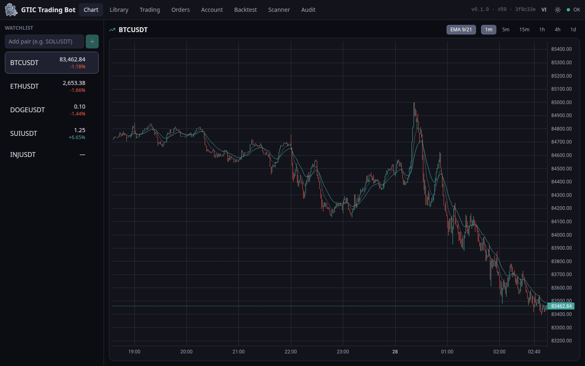

</div>

---

## Why

Most retail bots either hide the logic or push you straight to real money. GTIC is built for the opposite workflow: **prove a strategy is stable before it touches a cent**, keep a human in the loop, and log everything.

- **One strategy interface, four modes.** The same `.py` file runs in Backtest, Paper, Testnet and Live, so what you backtest is exactly what trades.
- **Realistic simulation.** Paper trading and the account-simulation backtester share the same code: equity-based sizing, maker/taker fees, slippage, intra-candle SL/TP fills, and daily-loss and drawdown guards.
- **Realtime.** Binance WebSocket → in-process event bus → browser WebSocket, with sub-second latency and no polling.
- **Safety first.** Live trading is off by default, needs an env flag *and* a typed confirmation, and every order (bot or manual) is written to an audit log **before** it reaches the exchange.

## Features

| | |
|---|---|
| 📈 **Realtime charts** | Lightweight Charts candles with strategy overlays, watchlist, and 1m → 1d timeframes |
| 🧠 **Strategy library** | 15+ built-in strategies (EMA/MACD cross, Supertrend, Donchian, Ichimoku, Keltner, Bollinger, VWAP, ICT PO3…), each with a methodology doc |
| 🧪 **Two backtest engines** | Fast vectorised runs (vectorbt) and a full **account simulation** that mirrors paper trading, including a side-by-side position-sizing comparison |
| 🤖 **Bots** | Run any strategy/version/params per symbol & timeframe; pause, stop, and resume; auto-pause on feed loss |
| ✋ **Manual control** | Place orders, move SL/TP, close positions by hand — at any time, alongside bots |
| 🔍 **Trade review** | Per-trade R multiple, MFE/MAE, time held, exit reason, and a chart replay of each trade |
| 💰 **Accounts & risk** | Risk-per-trade sizing, max open risk, max positions, daily-loss and max-drawdown circuit breakers |
| 📡 **Scanner** | Periodically ranks pairs by signal strength with ATR-based SL/TP suggestions |
| 🧾 **Audit log** | Every order and system action, recorded before it's sent |
| 🌗 **Polished UI** | Light/dark themes, responsive desktop + mobile layout, English and Vietnamese |

## Screenshots

<table>
  <tr>
    <td colspan="2"><b>Backtest — account simulation with position-sizing comparison</b><br/>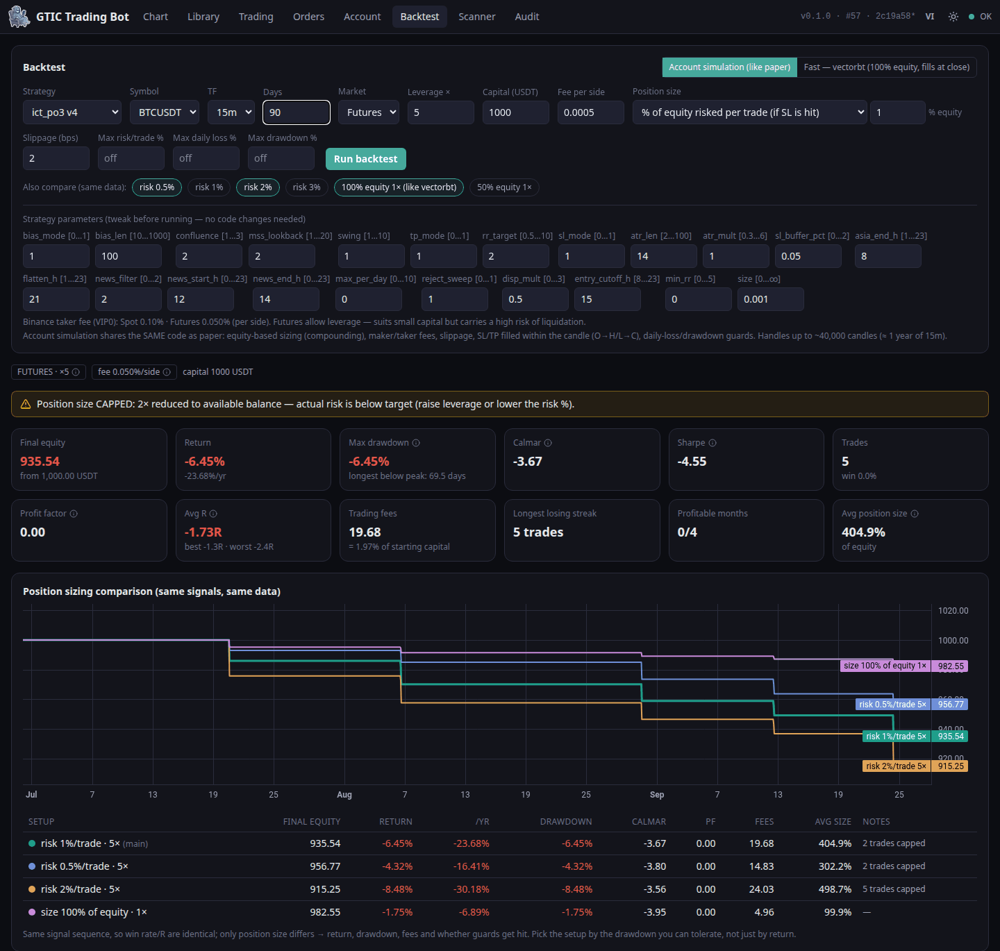</td>
  </tr>
  <tr>
    <td colspan="2"><b>Backtest chart — entries/exits plotted on candles, plus the trade list</b><br/>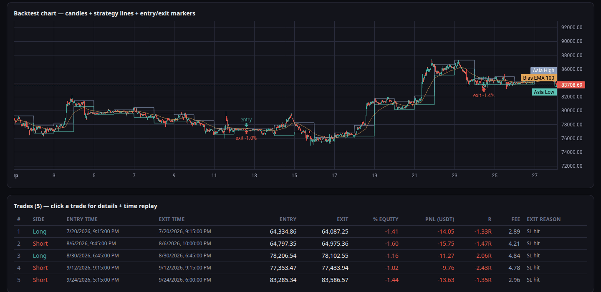</td>
  </tr>
  <tr>
    <td colspan="2"><b>Trade review — entry/exit, SL/TP, MFE/MAE on the chart, with a time-replay slider</b><br/>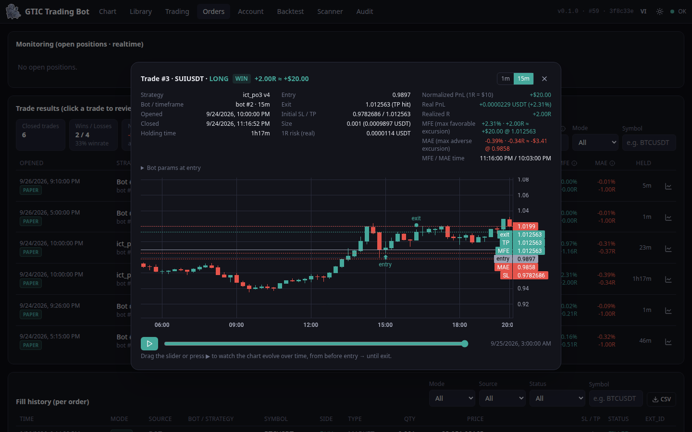</td>
  </tr>
  <tr>
    <td width="50%"><b>Trade results — R multiples, win/loss, MFE/MAE</b><br/>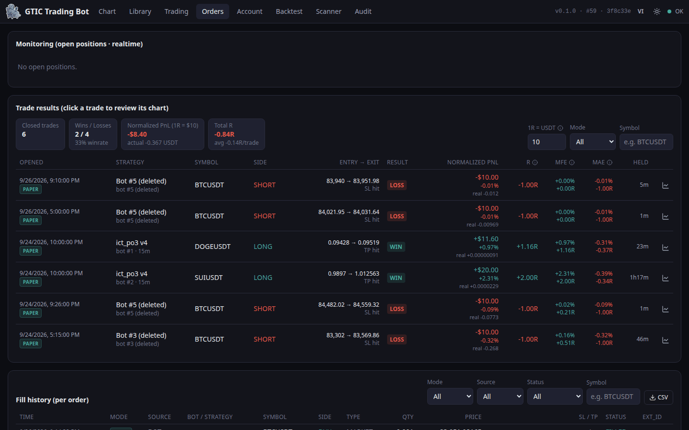</td>
    <td width="50%"><b>Strategy library & methodology docs</b><br/>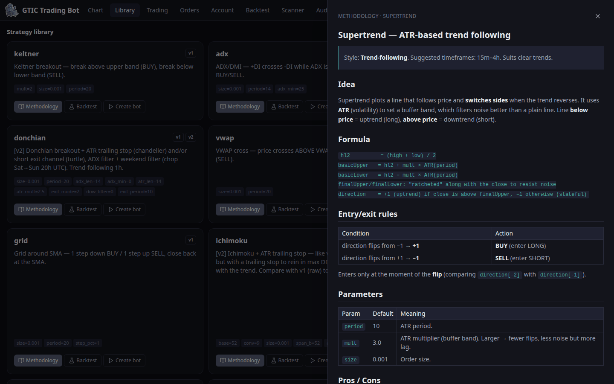</td>
  </tr>
  <tr>
    <td width="50%"><b>Account, equity & risk guards</b><br/>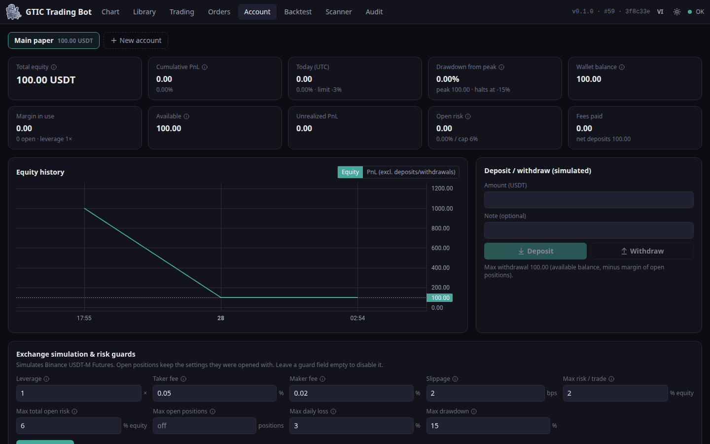</td>
    <td width="50%"><b>Bots & manual orders</b><br/>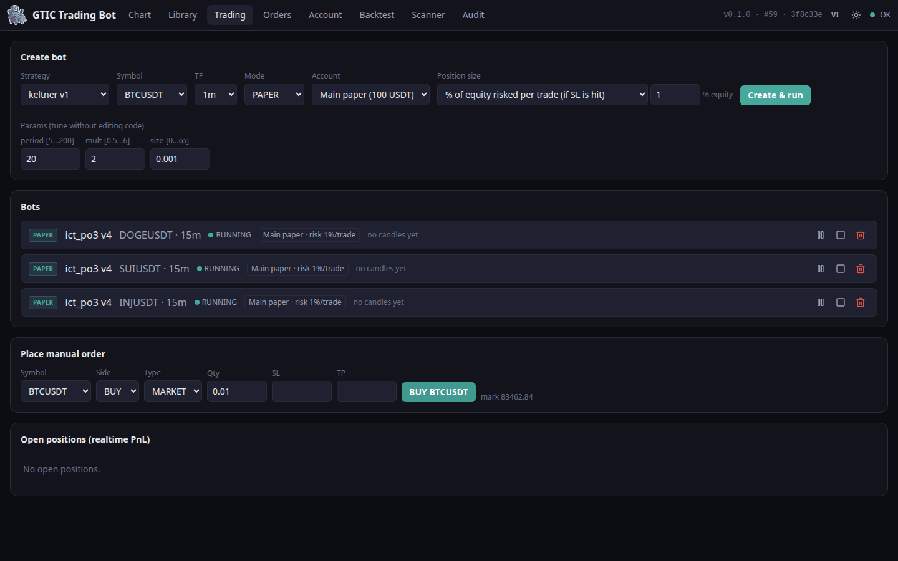</td>
  </tr>
  <tr>
    <td width="50%"><b>Pair scanner</b><br/>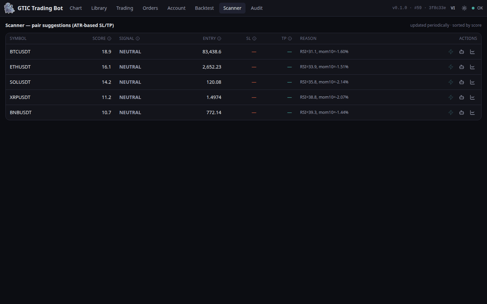</td>
    <td width="50%"><b>Audit log — every order recorded before it is sent</b><br/>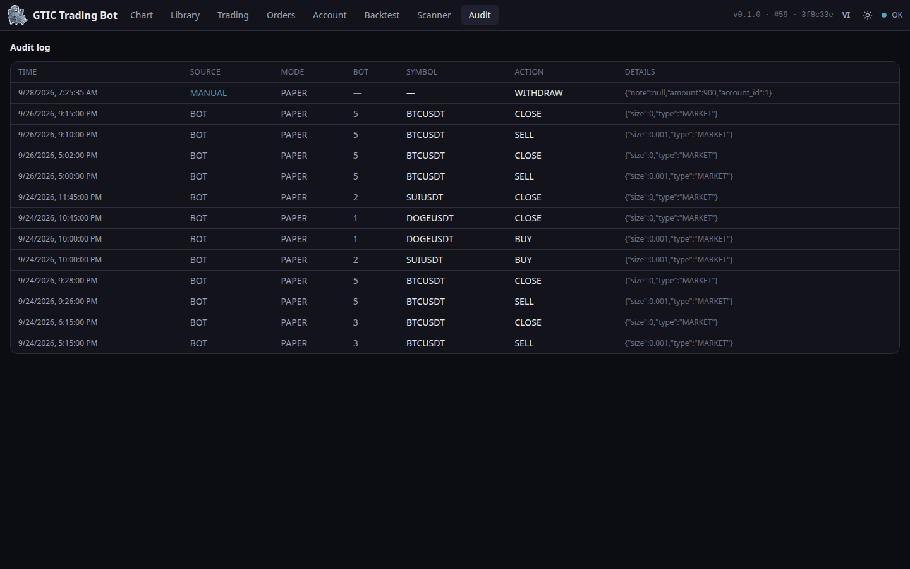</td>
  </tr>
  <tr>
    <td colspan="2" align="center"><b>Mobile</b><br/>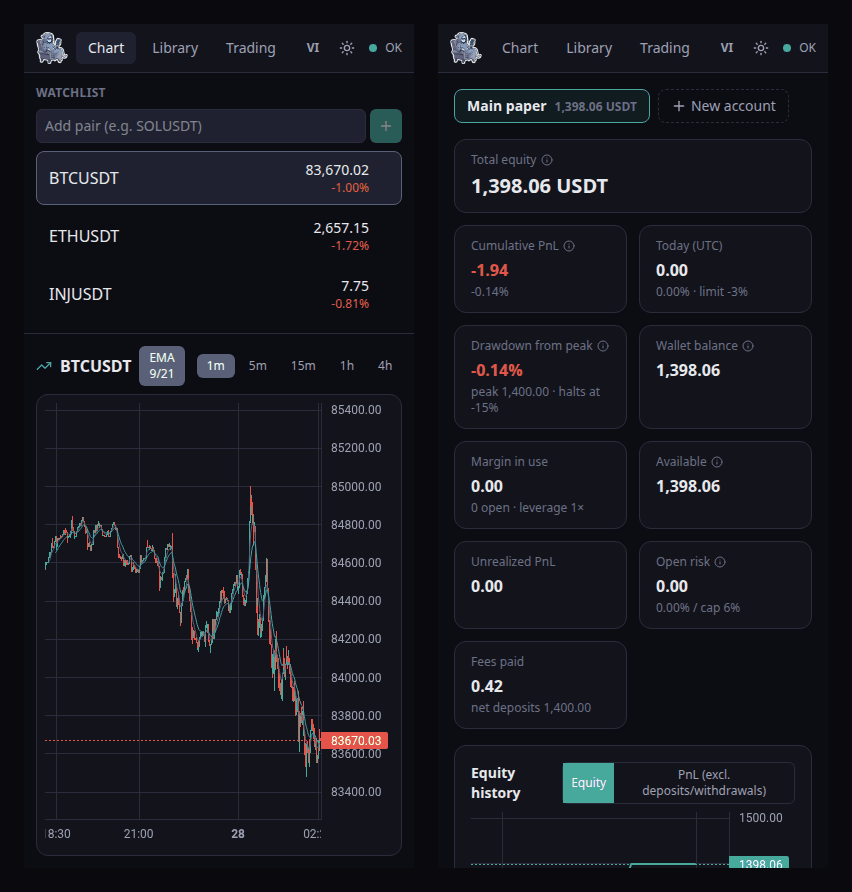</td>
  </tr>
</table>

> Screenshots are taken from a real paper-trading instance. The numbers illustrate the UI — they are **not** performance claims.

## Operating modes

| Mode | Market data | Order execution | Money at risk |
|---|---|---|---|
| **Backtest** | Historical klines (TimescaleDB) | Simulated fills (vectorbt or account simulation) | None |
| **Paper** | Live Binance WebSocket | Internal matching engine, no exchange calls | None |
| **Testnet** | Live Binance WebSocket | Binance Futures **testnet** | Test funds |
| **Live** | Live Binance WebSocket | Binance USDⓈ-M Futures | ⚠️ **Real** — requires `ENABLE_LIVE=1` + typing `LIVE` to confirm |

## Architecture

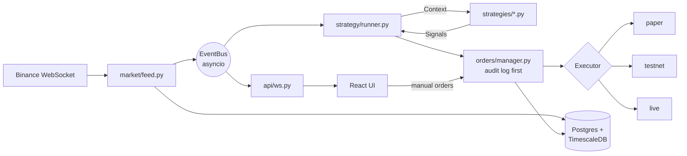

A single Python process (FastAPI + asyncio) — no microservices, no message broker. Changing mode means swapping the `Executor` adapter; strategies never know which mode they run in.

**Stack:** Python 3.12 · FastAPI · python-binance · SQLAlchemy (async) + Alembic · Postgres/TimescaleDB · vectorbt · React 19 · TypeScript · Vite · Tailwind CSS v4 · TanStack Query/Table · Zustand · Lightweight Charts.

## Quick start

### Docker (recommended)

```bash
git clone https://github.com/huypq6/gtic-bot.git
cd gtic-bot
cp env.example .env          # defaults are fine for paper trading
docker compose up --build
```

Open **http://localhost:8000**. The app serves the UI and API on one port, and runs database migrations on startup. Backtesting and paper trading work out of the box — no API keys needed.

### Local development

Requirements: Python 3.12+, [uv](https://docs.astral.sh/uv/), Node 20+ (22 LTS recommended), Docker (for the database).

```bash
# Database (TimescaleDB)
docker compose -f docker-compose.dev.yml up -d db

# Backend
uv sync --extra backtest
uv run alembic upgrade head
uv run uvicorn app.main:app --reload

# Frontend (in another terminal) — Vite dev server with API proxy
cd frontend && npm install && npm run dev
```

### Configuration

All settings come from environment variables (see [`env.example`](env.example)):

| Variable | Purpose |
|---|---|
| `DATABASE_URL` | Postgres/TimescaleDB connection (`postgresql+asyncpg://…`) |
| `BINANCE_TESTNET_KEY` / `BINANCE_TESTNET_SECRET` | Futures testnet keys (for Testnet mode) |
| `BINANCE_KEY` / `BINANCE_SECRET` | Live keys — **Futures + read only, withdrawals disabled, IP-whitelisted** |
| `ENABLE_LIVE` | Must be `1` for Live mode to be available at all (default `0`) |

## Writing a strategy

Strategies are plain Python files in [`app/strategy/strategies/`](app/strategy/strategies/). They only read a `Context` and return `Signal`s — no API calls, no DB, no I/O.

```python
from app.strategy.base import Context, Signal, Strategy
from app.strategy.registry import register
from app.strategy.ta import ema


@register
class EmaCross(Strategy):
    name = "ema_cross"
    version = "1"                      # bump when the logic changes
    description = "Fast/slow EMA crossover — golden cross LONG, death cross SHORT."
    default_params = {"fast": 9, "slow": 21, "size": 0.001}
    param_schema = {                   # renders the params form in the UI
        "fast": {"type": "int", "min": 2, "max": 100, "default": 9},
        "slow": {"type": "int", "min": 3, "max": 200, "default": 21},
        "size": {"type": "float", "min": 0.0, "default": 0.001},
    }

    def on_candle(self, ctx: Context) -> list[Signal]:
        closes = [c["close"] for c in ctx.candles]
        fast, slow = ema(closes, self.params["fast"]), ema(closes, self.params["slow"])
        if len(fast) < 2 or len(slow) < 2:
            return []
        size = self.params["size"]
        if fast[-2] <= slow[-2] and fast[-1] > slow[-1]:
            return [Signal("BUY", ctx.symbol, size)]
        if fast[-2] >= slow[-2] and fast[-1] < slow[-1]:
            return [Signal("SELL", ctx.symbol, size)]
        return []
```

Drop in a `<name>.md` next to it and it shows up as the methodology doc in the Library. The full guide — backtesting, walk-forward validation, and a readiness checklist before going live — is in [docs/05-Strategy-Dev-Guide.md](docs/05-Strategy-Dev-Guide.md).

## Project layout

```
app/                     FastAPI backend (single process)
  market/                Binance WS feed, event bus, kline store, watchlist
  strategy/              Strategy base, registry, runner, TA helpers
    strategies/          ← your strategies live here (.py + .md docs)
  execution/             Executors: paper engine, Binance Futures testnet/live
  orders/                Order manager, positions, trade stats, audit log
  account/               Accounts, ledger, risk sizing & guards
  backtest/              vectorbt engine + account simulation
  scanner/               Pair scanner
  api/                   REST routes + WebSocket gateway
frontend/                React 19 + Vite + Tailwind v4 UI (src/locales for translations)
alembic/                 Database migrations
tests/                   pytest suite
docs/                    Guides, runbooks, screenshots
```

## Testing

```bash
uv run ruff check .
uv run pytest -q                 # DB-backed tests are skipped if Postgres isn't reachable
cd frontend && npm run build     # type-check + production build
```

CI runs all of the above on every push and pull request.

## Documentation

| Doc | |
|---|---|
| [05 — Strategy Development Guide](docs/05-Strategy-Dev-Guide.md) | Writing, backtesting and validating strategies |
| [06 — Paper Trading Runbook](docs/06-Paper-Trading-Runbook.md) | Running and monitoring paper bots |
| [07 — Exchange Smoke Test](docs/07-Exchange-Smoke-Test.md) | Checklist before using Testnet/Live keys |
| [00 — Plan](docs/00-Plan.md) | Solution summary, stack decisions, roadmap |
| [01 — BRD](docs/01-BRD.md) · [02 — URD](docs/02-URD.md) | Business & user requirements, user stories |
| [03 — ASCII Mockups](docs/03-ASCII-Mockups.md) | Original wireframes |
| [04 — SRS](docs/04-SRS.md) | Software requirements: interfaces, data model, API, NFRs |

## Language

The UI is in **English** by default. Click **VI** in the header to switch to Vietnamese (**EN** switches back). Translations live in [`frontend/src/locales/vi/`](frontend/src/locales/vi/): English strings are the keys, so adding a language means adding one dictionary.

<details><summary>Vietnamese UI</summary>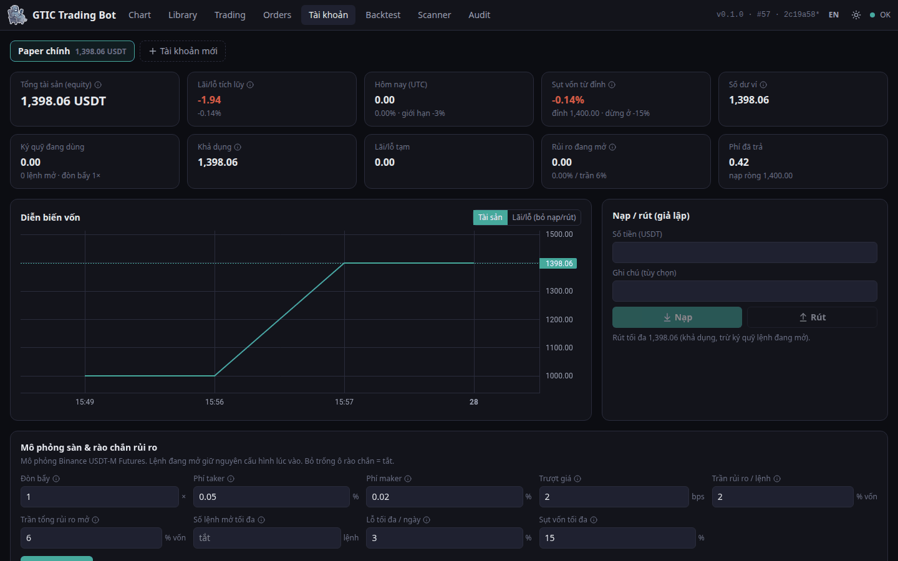</details>

## Status

All phases are built: market feed and charts, paper trading, order management, backtesting, strategy versioning, testnet, scanner, live-mode safeguards, and accounts/risk management. **Testnet/Live on Binance Futures is implemented but has not yet been smoke-tested with real keys** (see [docs/07](docs/07-Exchange-Smoke-Test.md)). Treat those modes as experimental.

## Security

GTIC is single-user and has **no built-in login** — anyone who can reach the port can place orders.
**Do not expose it to the internet**: keep it on localhost/LAN, behind a VPN, or behind an authenticating
reverse proxy. Use Live keys with withdrawals disabled and an IP whitelist. See [SECURITY.md](SECURITY.md).

## Contributing

Issues and pull requests are welcome — see [CONTRIBUTING.md](CONTRIBUTING.md).

## ⚠️ Disclaimer

This software is for **educational and research purposes**. Trading cryptocurrency derivatives with leverage carries a high risk of loss, including total loss of funds. Nothing in this repository is financial advice. Backtest and paper results do not guarantee future performance. You are solely responsible for any use of this software with real money. Start with paper trading, then testnet, and only risk what you can afford to lose.

### Legal notice

- GTIC is **free, non-commercial, self-hosted software**. It is not an exchange, broker, custodian, or investment
  service: it holds no user funds, matches no orders for others, charges no fees, and has no affiliation with or
  referral arrangement with Binance or any other exchange.
- **You are responsible for complying with the laws of your jurisdiction** before connecting it to a real exchange
  account. Cryptocurrency and crypto-derivatives trading is restricted or regulated in many countries, and using an
  exchange that is not licensed where you live may be unlawful.
- **Vietnam:** under Resolution 05/2025/NQ-CP and Decree 284/2026/NĐ-CP, domestic investors are expected to trade
  crypto assets only through service providers licensed by the Ministry of Finance, and trading elsewhere may be
  subject to administrative fines once the transition period ends. Providing crypto-related services without a
  licence is also sanctioned. Backtest, Paper and Testnet modes do not trade real assets.
- Do not use this software to provide trading, fund-management, signal or hosting services to others without the
  licences required in your jurisdiction.
- This notice is not legal advice. If in doubt, consult a qualified lawyer.

## License

[MIT](LICENSE) © Huy Pham
