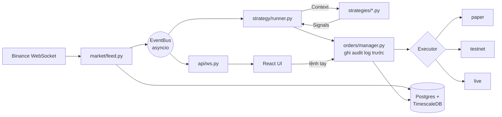

<div align="center">


# GTIC Trading Bot

[English](README.md) · **Tiếng Việt**

**Ghost Trader In Chair** — nền tảng bot giao dịch tự host, dành cho một người dùng, chạy trên **Binance USDⓈ-M Futures**.<br/>
Viết chiến thuật một lần, rồi đưa nó đi từ **backtest → paper → testnet → live** mà không phải sửa một dòng code.

[](https://github.com/huypq6/gtic-bot/actions/workflows/ci.yml)


[](LICENSE)


</div>

---

## Vì sao có GTIC

Phần lớn bot cho nhà đầu tư cá nhân hoặc giấu logic, hoặc đẩy bạn vào tiền thật ngay. GTIC làm ngược lại: **chứng minh chiến thuật ổn định trước khi đụng tới đồng nào**, luôn để con người can thiệp được, và ghi lại mọi thứ.

- **Một interface chiến thuật, bốn chế độ.** Cùng một file `.py` chạy ở Backtest, Paper, Testnet và Live — thứ bạn backtest chính là thứ sẽ giao dịch.
- **Mô phỏng sát thực tế.** Paper trading và backtest mô phỏng tài khoản dùng chung code: khối lượng theo vốn, phí maker/taker, trượt giá, khớp SL/TP trong nến, rào chắn lỗ trong ngày và sụt vốn.
- **Realtime.** Binance WebSocket → event bus trong tiến trình → WebSocket tới trình duyệt, độ trễ dưới 1 giây, không polling.
- **An toàn trên hết.** Live mặc định tắt, cần cờ môi trường *và* gõ xác nhận; mọi lệnh (bot hay tay) được ghi audit log **trước khi** gửi lên sàn.

## Tính năng

| | |
|---|---|
| 📈 **Chart realtime** | Nến Lightweight Charts kèm đường chỉ báo của chiến thuật, watchlist, khung 1m → 1d |
| 🧠 **Thư viện chiến thuật** | 15+ chiến thuật dựng sẵn (EMA/MACD cross, Supertrend, Donchian, Ichimoku, Keltner, Bollinger, VWAP, ICT PO3…), mỗi cái có tài liệu phương pháp |
| 🧪 **Hai engine backtest** | Chạy nhanh dạng vector (vectorbt) và **mô phỏng tài khoản** đầy đủ giống hệt paper, có so sánh các cách quản lý vốn cạnh nhau |
| 🤖 **Bot** | Chạy bất kỳ chiến thuật/phiên bản/tham số nào theo cặp & khung thời gian; tạm dừng, dừng, chạy lại; tự tạm dừng khi mất feed |
| ✋ **Can thiệp tay** | Đặt lệnh, dời SL/TP, đóng vị thế bằng tay — bất cứ lúc nào, song song với bot |
| 🔍 **Review lệnh** | Bội số R, MFE/MAE, thời gian giữ lệnh, lý do thoát và tua lại biểu đồ của từng lệnh |
| 💰 **Tài khoản & rủi ro** | Khối lượng theo % rủi ro mỗi lệnh, trần rủi ro đang mở, số vị thế tối đa, ngắt khi lỗ trong ngày / sụt vốn quá ngưỡng |
| 📡 **Scanner** | Định kỳ xếp hạng các cặp theo độ mạnh tín hiệu, gợi ý SL/TP theo ATR |
| 🧾 **Audit log** | Mọi lệnh và hành động hệ thống, ghi lại trước khi gửi |
| 🌗 **Giao diện chỉn chu** | Sáng/tối, responsive desktop + mobile, tiếng Anh và tiếng Việt |

## Ảnh chụp màn hình

<table>
  <tr>
    <td colspan="2"><b>Backtest — mô phỏng tài khoản, so sánh các cách quản lý vốn</b><br/></td>
  </tr>
  <tr>
    <td colspan="2"><b>Biểu đồ backtest — điểm vào/ra vẽ trên nến, kèm danh sách lệnh</b><br/></td>
  </tr>
  <tr>
    <td colspan="2"><b>Review lệnh — entry/exit, SL/TP, MFE/MAE trên biểu đồ, có thanh tua theo thời gian</b><br/></td>
  </tr>
  <tr>
    <td width="50%"><b>Kết quả giao dịch — bội số R, thắng/thua, MFE/MAE</b><br/></td>
    <td width="50%"><b>Thư viện chiến thuật & tài liệu phương pháp</b><br/></td>
  </tr>
  <tr>
    <td width="50%"><b>Tài khoản, vốn & rào chắn rủi ro</b><br/></td>
    <td width="50%"><b>Bot & đặt lệnh tay</b><br/></td>
  </tr>
  <tr>
    <td width="50%"><b>Scanner tìm cặp</b><br/></td>
    <td width="50%"><b>Audit log — mọi lệnh được ghi trước khi gửi</b><br/></td>
  </tr>
  <tr>
    <td colspan="2" align="center"><b>Mobile</b><br/></td>
  </tr>
</table>

> Ảnh chụp từ một instance paper trading thật. Các con số chỉ để minh họa giao diện — **không** phải cam kết hiệu quả.

## Các chế độ vận hành

| Chế độ | Dữ liệu thị trường | Khớp lệnh | Tiền chịu rủi ro |
|---|---|---|---|
| **Backtest** | Nến lịch sử (TimescaleDB) | Khớp giả lập (vectorbt hoặc mô phỏng tài khoản) | Không |
| **Paper** | Binance WebSocket realtime | Engine khớp lệnh nội bộ, không gọi sàn | Không |
| **Testnet** | Binance WebSocket realtime | **Testnet** Binance Futures | Tiền thử nghiệm |
| **Live** | Binance WebSocket realtime | Binance USDⓈ-M Futures | ⚠️ **Tiền thật** — cần `ENABLE_LIVE=1` + gõ `LIVE` để xác nhận |

## Kiến trúc



Một tiến trình Python duy nhất (FastAPI + asyncio) — không microservice, không message broker. Đổi chế độ = đổi adapter `Executor`; chiến thuật không hề biết mình đang chạy ở chế độ nào.

**Stack:** Python 3.12 · FastAPI · python-binance · SQLAlchemy (async) + Alembic · Postgres/TimescaleDB · vectorbt · React 19 · TypeScript · Vite · Tailwind CSS v4 · TanStack Query/Table · Zustand · Lightweight Charts.

## Bắt đầu nhanh

### Docker (khuyến nghị)

```bash
git clone https://github.com/huypq6/gtic-bot.git
cd gtic-bot
cp env.example .env          # giá trị mặc định đủ để chạy paper trading
docker compose up --build
```

Mở **http://localhost:8000**. App phục vụ cả giao diện lẫn API trên cùng một cổng và tự chạy migration database khi khởi động. Backtest và paper trading dùng được ngay — không cần API key.

Giao diện mặc định là tiếng Anh; bấm **VI** trên thanh header để chuyển sang tiếng Việt.

### Phát triển local

Yêu cầu: Python 3.12+, [uv](https://docs.astral.sh/uv/), Node 20+ (khuyến nghị 22 LTS), Docker (cho database).

```bash
# Database (TimescaleDB)
docker compose -f docker-compose.dev.yml up -d db

# Backend
uv sync --extra backtest
uv run alembic upgrade head
uv run uvicorn app.main:app --reload

# Frontend (terminal khác) — Vite dev server, có proxy sang API
cd frontend && npm install && npm run dev
```

### Cấu hình

Mọi thiết lập lấy từ biến môi trường (xem [`env.example`](env.example)):

| Biến | Công dụng |
|---|---|
| `DATABASE_URL` | Kết nối Postgres/TimescaleDB (`postgresql+asyncpg://…`) |
| `BINANCE_TESTNET_KEY` / `BINANCE_TESTNET_SECRET` | Key testnet Futures (cho chế độ Testnet) |
| `BINANCE_KEY` / `BINANCE_SECRET` | Key live — **chỉ Futures + đọc, tắt rút tiền, whitelist IP** |
| `ENABLE_LIVE` | Phải bằng `1` thì chế độ Live mới xuất hiện (mặc định `0`) |

## Viết chiến thuật

Chiến thuật là file Python thuần trong [`app/strategy/strategies/`](app/strategy/strategies/). Chúng chỉ đọc `Context` và trả về danh sách `Signal` — không gọi API, không đụng DB, không I/O.

```python
from app.strategy.base import Context, Signal, Strategy
from app.strategy.registry import register
from app.strategy.ta import ema


@register
class EmaCross(Strategy):
    name = "ema_cross"
    version = "1"                      # tăng khi đổi logic
    description = "Fast/slow EMA crossover — golden cross LONG, death cross SHORT."
    default_params = {"fast": 9, "slow": 21, "size": 0.001}
    param_schema = {                   # UI tự dựng form tham số từ đây
        "fast": {"type": "int", "min": 2, "max": 100, "default": 9},
        "slow": {"type": "int", "min": 3, "max": 200, "default": 21},
        "size": {"type": "float", "min": 0.0, "default": 0.001},
    }

    def on_candle(self, ctx: Context) -> list[Signal]:
        closes = [c["close"] for c in ctx.candles]
        fast, slow = ema(closes, self.params["fast"]), ema(closes, self.params["slow"])
        if len(fast) < 2 or len(slow) < 2:
            return []
        size = self.params["size"]
        if fast[-2] <= slow[-2] and fast[-1] > slow[-1]:
            return [Signal("BUY", ctx.symbol, size)]
        if fast[-2] >= slow[-2] and fast[-1] < slow[-1]:
            return [Signal("SELL", ctx.symbol, size)]
        return []
```

Đặt thêm file `<name>.md` cạnh nó (và `<name>.vi.md` cho bản tiếng Việt) để hiện thành tài liệu phương pháp trong Library. Hướng dẫn đầy đủ — backtest, kiểm chứng walk-forward và checklist trước khi chạy thật — ở [docs/05-Strategy-Dev-Guide.md](docs/05-Strategy-Dev-Guide.md) (tiếng Anh).

## Cấu trúc thư mục

```
app/                     Backend FastAPI (một tiến trình)
  market/                Feed Binance WS, event bus, lưu nến, watchlist
  strategy/              Strategy base, registry, runner, hàm TA
    strategies/          ← chiến thuật của bạn nằm ở đây (.py + tài liệu .md)
  execution/             Executor: paper engine, Binance Futures testnet/live
  orders/                Order manager, vị thế, thống kê lệnh, audit log
  account/               Tài khoản, sổ cái, tính khối lượng & rào chắn rủi ro
  backtest/              Engine vectorbt + mô phỏng tài khoản
  scanner/               Scanner tìm cặp
  api/                   REST routes + WebSocket gateway
frontend/                Giao diện React 19 + Vite + Tailwind v4 (src/locales chứa bản dịch)
alembic/                 Migration database
tests/                   Bộ test pytest
docs/                    Hướng dẫn, runbook, ảnh chụp màn hình
```

## Kiểm thử

```bash
uv run ruff check .
uv run pytest -q                 # test cần DB tự bỏ qua nếu không kết nối được Postgres
cd frontend && npm run build     # type-check + build production
```

CI chạy tất cả các bước trên (kèm service TimescaleDB) ở mỗi lần push và pull request.

## Tài liệu

Các tài liệu trong `docs/` viết bằng tiếng Anh.

| Tài liệu | |
|---|---|
| [05 — Strategy Development Guide](docs/05-Strategy-Dev-Guide.md) | Viết, backtest và kiểm chứng chiến thuật |
| [06 — Paper Trading Runbook](docs/06-Paper-Trading-Runbook.md) | Chạy và theo dõi bot paper |
| [07 — Exchange Smoke Test](docs/07-Exchange-Smoke-Test.md) | Checklist trước khi dùng key Testnet/Live |
| [00 — Plan](docs/00-Plan.md) | Tóm tắt giải pháp, quyết định stack, roadmap |
| [01 — BRD](docs/01-BRD.md) · [02 — URD](docs/02-URD.md) | Yêu cầu nghiệp vụ & người dùng, user story |
| [03 — ASCII Mockups](docs/03-ASCII-Mockups.md) | Wireframe ban đầu |
| [04 — SRS](docs/04-SRS.md) | Đặc tả phần mềm: interface, mô hình dữ liệu, API, NFR |

## Ngôn ngữ

Giao diện mặc định là **tiếng Anh**. Bấm **VI** trên header để chuyển sang tiếng Việt (bấm **EN** để quay lại); lựa chọn được ghi nhớ. Bản dịch nằm ở [`frontend/src/locales/vi/`](frontend/src/locales/vi/): chuỗi tiếng Anh là khóa, nên thêm một ngôn ngữ mới chỉ cần thêm một từ điển.

<details open><summary>Giao diện tiếng Việt</summary></details>

## Trạng thái

Đã xây xong mọi phase: feed thị trường & chart, paper trading, quản lý lệnh, backtest, versioning chiến thuật, testnet, scanner, rào chắn cho chế độ live, tài khoản & quản lý rủi ro. **Testnet/Live trên Binance Futures đã code xong nhưng chưa được chạy thử với key thật** (xem [docs/07](docs/07-Exchange-Smoke-Test.md)). Hãy coi các chế độ này là thử nghiệm.

## Bảo mật

GTIC dành cho một người dùng và **không có đăng nhập** — ai truy cập được cổng đều đặt được lệnh.
**Đừng mở ra internet**: chỉ chạy trên localhost/LAN, sau VPN, hoặc sau reverse proxy có xác thực.
Dùng key Live đã tắt quyền rút tiền và bật whitelist IP. Xem [SECURITY.md](SECURITY.md).

## Đóng góp

Hoan nghênh issue và pull request — xem [CONTRIBUTING.md](CONTRIBUTING.md).

## ⚠️ Miễn trừ trách nhiệm

Phần mềm này phục vụ **mục đích học tập và nghiên cứu**. Giao dịch phái sinh tiền mã hóa có đòn bẩy có rủi ro thua lỗ cao, kể cả mất toàn bộ vốn. Không nội dung nào trong repo này là tư vấn tài chính. Kết quả backtest và paper không đảm bảo hiệu quả trong tương lai. Bạn hoàn toàn chịu trách nhiệm khi dùng phần mềm này với tiền thật. Hãy bắt đầu bằng paper trading, rồi testnet, và chỉ mạo hiểm số tiền bạn chấp nhận mất.

### Lưu ý pháp lý

- GTIC là **phần mềm tự host, miễn phí, phi thương mại**. Nó không phải sàn giao dịch, môi giới, đơn vị lưu ký
  hay dịch vụ đầu tư: không giữ tiền của người dùng, không khớp lệnh cho người khác, không thu phí, và không có
  liên kết hay chương trình giới thiệu (referral) nào với Binance hoặc bất kỳ sàn nào khác.
- **Bạn tự chịu trách nhiệm tuân thủ pháp luật nơi mình sinh sống** trước khi kết nối với tài khoản sàn thật.
  Giao dịch tiền mã hóa và phái sinh tiền mã hóa bị hạn chế hoặc quản lý ở nhiều quốc gia; dùng sàn không được cấp
  phép tại nơi bạn sống có thể vi phạm pháp luật.
- **Việt Nam:** theo Nghị quyết 05/2025/NQ-CP và Nghị định 284/2026/NĐ-CP, nhà đầu tư trong nước chỉ được giao dịch
  tài sản mã hóa qua tổ chức cung cấp dịch vụ được Bộ Tài chính cấp phép; giao dịch ở nơi khác có thể bị xử phạt
  hành chính sau khi hết thời gian chuyển tiếp. Cung cấp dịch vụ liên quan đến tài sản mã hóa khi chưa được cấp phép
  cũng bị xử phạt. Các chế độ Backtest, Paper và Testnet không giao dịch tài sản thật.
- Không dùng phần mềm này để cung cấp dịch vụ giao dịch, quản lý vốn, bán tín hiệu hay hosting cho người khác khi
  chưa có giấy phép theo quy định nơi bạn hoạt động.
- Lưu ý này không phải tư vấn pháp lý. Nếu còn băn khoăn, hãy hỏi luật sư có chuyên môn.

## Giấy phép

[MIT](LICENSE) © Huy Pham
